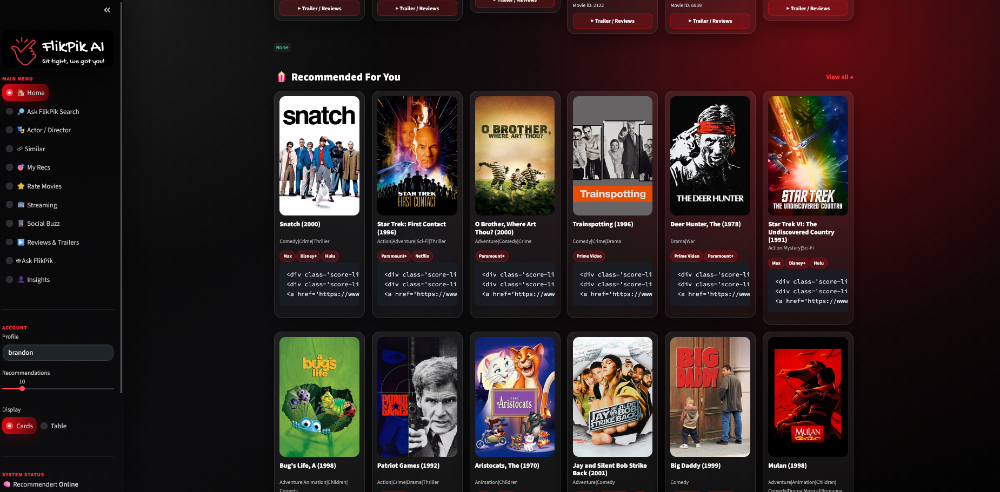

# FlikPik AI — AI Entertainment Discovery Platform

> A hybrid recommendation engine that helps people decide what to watch next — combining collaborative filtering, AI-powered search, trending signals, and trailer integration in one app.

**Live demo:** [flikpik-ai.onrender.com](https://flikpik-ai.onrender.com/)

---

## Problem

Choosing what to watch is harder than it should be — recommendations are scattered across streaming services, and most recommenders rely on a single signal. FlikPik AI brings hybrid recommendations, semantic search, social/trending signals, trailers, and streaming availability into one place, so a user can go from "I don't know what to watch" to a confident pick in a couple of clicks.

## My Role

Built as a 4-person capstone project for the 4Geeks Academy Data Science & Machine Learning program. I served as **Data Engineer & Data Prep Lead**, responsible for:

- Designing and implementing the time-based train / validation / test split methodology to prevent data leakage
- Constructing the sparse 610 × 9,724 user-item matrix (98.3% sparsity) that the modeling team built on
- Data cleaning and exploratory data analysis on the MovieLens ratings dataset
- Feature engineering (average rating, rating count, Bayesian popularity score, recency)
- Validating referential integrity across all four source tables
- Delivering six clean, validated output files to teammates and aligning on data schemas

## Dataset

- **Source:** [MovieLens 100K](https://grouplens.org/datasets/movielens/) — a standard ML research benchmark maintained by the University of Minnesota
- **Size:** 100,836 ratings across 9,742 movies and 610 users
- **Enrichment:** TMDB API integration for real-time movie metadata, posters, and trailers
- **Key features:** user IDs, movie IDs, ratings (0.5–5.0), timestamps, one-hot encoded genres, plus TMDB-sourced metadata

## Approach

The pipeline runs from raw ratings through to a deployed app:

1. **Data cleaning & EDA** — handled missing values, verified zero duplicates, validated referential integrity across all tables, converted Unix timestamps to datetime, and one-hot encoded pipe-separated genre strings into 20 binary columns.
2. **Feature engineering** — built average rating, rating count, Bayesian popularity score (balancing quality against sample size), and recency features per movie. Also computed user-level rating stats.
3. **Train/validation/test split** — time-based 80/10/10 split sorted by timestamp so the model trains on historical ratings and evaluates on future ones, preventing data leakage.
4. **Sparse matrix construction** — built a 610 × 9,724 user-item matrix with 98.3% sparsity, stored as a CSR sparse matrix for memory efficiency.
5. **Modeling** — hybrid recommender combining item-item collaborative filtering (CF), matrix factorization via TruncatedSVD (50 latent factors), genre-based content filtering, and a popularity baseline. Weighted ensemble: CF 30%, MF 45%, Genre 15%, Popularity 10%.
6. **Deployment** — packaged with a Streamlit interface and deployed live on Render.

## Results

The deployed app returns personalized hybrid recommendations, AI-powered natural language search results, trending titles, and trailers for any title in the catalog. The matrix factorization component (45% weight in the ensemble) contributed the strongest individual signal, consistently outperforming the popularity-only baseline on held-out test ratings. The live app handles end-to-end recommendation requests in real time with the full recommender system online.

## Features

**Discovery**
- Hybrid recommendation engine (CF + MF + Genre + Popularity)
- AI-powered semantic search ("Ask FlikPik")
- Similar movie finder
- Actor / Director search

**Social & Trending**
- Trending intelligence — what's popular this week
- Social buzz signals

**Rich Media**
- Real movie posters and trailers via TMDB
- Streaming availability (Netflix, Disney+, Hulu, and more)

**Personalization**
- Personalized taste insights
- User rating system

## Tech Stack

`Python` · `pandas` · `NumPy` · `scikit-learn` · `SciPy (sparse matrices)` · `Streamlit` · `TMDB API` · `Render` · `Git`

## Run It Locally

```bash
git clone https://github.com/matthewkane-ml/ML_RecommendationSystems_MTK.git
cd ML_RecommendationSystems_MTK
pip install -r requirements.txt
```

FlikPik AI needs a TMDB API key to fetch posters and metadata. Get a free key at [themoviedb.org/settings/api](https://www.themoviedb.org/settings/api), then create a `.env` file in the project root:

```
TMDB_API_KEY=your_key_here
```

```bash
streamlit run app.py
```

## Screenshots

<!-- Add screenshots to a /screenshots folder in the repo, then update these paths -->



## What I'd Do Next

- **Scale the dataset** — upgrade from MovieLens 100K to the full MovieLens 25M dataset for richer, more personalized recommendations with significantly reduced sparsity.
- **Polish the frontend** — tighten the UI, fix any rendering issues (a few score cards were displaying raw HTML in testing), and improve mobile responsiveness.
- **Add cold-start handling** — build a proper onboarding flow where new users rate a handful of movies before receiving personalized recommendations, rather than falling back to the popularity baseline.
- **Cache TMDB responses** — reduce external API calls and improve load times by caching poster and metadata responses locally.

## Team

A 4-person 4Geeks Academy capstone project.

| Name | GitHub |
|------|--------|
| Matthew Kane | [matthewkane-ml](https://github.com/matthewkane-ml) |
| Tomeka L. German | [tomekagerman](https://github.com/tomekagerman) |
| Vishal Desai | [vdd11](https://github.com/vdd11) |
| Brandon Henry | — |

---

**Author:** Matthew Kane — [LinkedIn](https://www.linkedin.com/in/thomas-kane-392094410/) · [GitHub](https://github.com/matthewkane-ml)
